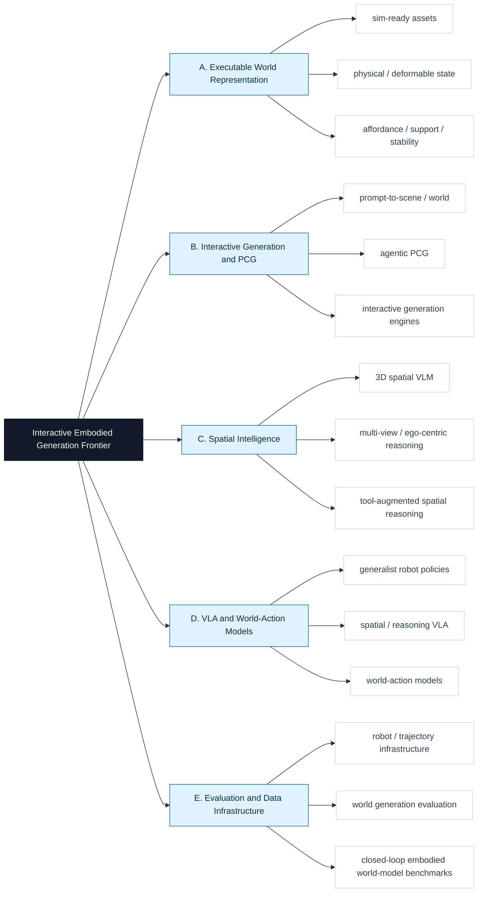

# Interactive Embodied Generation Frontier

面向 **可交互生成、具身智能、空间智能、VLA、可执行物理世界** 的 2024+ 前沿论文精读库。

这个仓库的核心不是堆论文列表，而是维护可复用的结构化精读报告：每篇最终收录论文都要说明原文链接、novelty、contribution、task、data、method、关键图/架构图、证据、局限和对我们任务的启发。

## 精读报告入口

| 内容 | 入口 |
|---|---|
| 层级化精读库 | [paper_reads/README.md](paper_reads/README.md) |
| 最新扩库摘要 | [reports/2026-06-06-expansion.md](reports/2026-06-06-expansion.md) |
| 当前已收录精读 | 46 篇，见 [paper_reads/README.md](paper_reads/README.md) |
| 待人工决定 | `undecided/` local-only，默认不上传 |

每次 run 的目的都是检查是否出现了新的高质量候选，并在通过标准后扩充知识库。run 目录只维护审计产物；最终论文精读统一沉淀到 `paper_reads/<branch>/<slug>.md`。通过筛选的候选应全部加入，不做固定 top-k 抽样。

## 本周更新内容

本轮初始化/扩库日期：2026-06-06。完整审计摘要见 [reports/2026-06-06-expansion.md](reports/2026-06-06-expansion.md)。

### 重点新增与补齐

| Paper | Branch | 简要说明 | 精读 |
|---|---|---|---|
| PhysX-Anything: Simulation-Ready Physical 3D Assets from Single Image | A | Strong object-level source for PhysicalProperty, KinematicJoint, AssetToSimulator, and contact-rich policy-learning validation. | [physx-anything-2025.md](paper_reads/A_executable_world_representation/physx-anything-2025.md) |
| SimuScene: Simulation-Ready Compositional 3D Scene Reconstruction from a Single Image | A | Relevant to SceneTree, SupportRelation, PhysicalViolation, and simulator-ready reconstruction validators. | [simuscene-2026.md](paper_reads/A_executable_world_representation/simuscene-2026.md) |
| REST3D: Reconstructing Physically Stable 3D Scenes from a Single Image | A | Provides a useful template for SceneTree, SupportGraph, StabilityCheck, and PhysicsRefinement stages. | [rest3d-2026.md](paper_reads/A_executable_world_representation/rest3d-2026.md) |
| TriSplat: Simulation-Ready Feed-Forward 3D Scene Reconstruction | A | Useful representation reference for MeshScene, CollisionSurface, and feed-forward sim-ready reconstruction. | [trisplat-2026.md](paper_reads/A_executable_world_representation/trisplat-2026.md) |
| SceneSmith: Agentic Generation of Simulation-Ready Indoor Scenes | B | Top PCG baseline for PromptToScene, CriticLoop, ObjectPopulation, PhysicalProperty, and policy evaluation. | [scenesmith-2026.md](paper_reads/B_interactive_generation_pcg/scenesmith-2026.md) |
| SceneFoundry: Generating Interactive Infinite 3D Worlds | B | Relevant PCG line for LayoutConstraint, ArticulationConstraint, WalkableSpace, and infinite-world expansion. | [scenefoundry-2026.md](paper_reads/B_interactive_generation_pcg/scenefoundry-2026.md) |
| HY-World 2.0: A Multi-Modal World Model for Reconstructing, Generating, and Simulating 3D Worlds | B | Strong open-source world-generation baseline for WorldRepresentation, TrajectoryPlan, 3DGSScene, MeshExport, and engine integration. | [hy-world-2-2026.md](paper_reads/B_interactive_generation_pcg/hy-world-2-2026.md) |
| SAGE: Scalable Agentic 3D Scene Generation for Embodied AI | B | closest PCG baseline; it can use a typed interaction representation as I/O and evaluator | [sage-2026.md](paper_reads/B_interactive_generation_pcg/sage-2026.md) |
| EmbodiedGen: Towards a Generative 3D World Engine for Embodied Intelligence | B | generation engine that can consume or be evaluated by a typed interactive-world representation | [embodiedgen-2025.md](paper_reads/B_interactive_generation_pcg/embodiedgen-2025.md) |
| SpatialStack: Layered Geometry-Language Fusion for 3D VLM Spatial Reasoning | C | Good spatial encoder/validator reference for local geometry, global context, and relation checking in generated worlds. | [spatialstack-2026.md](paper_reads/C_spatial_intelligence/spatialstack-2026.md) |
| SpaceTools: Tool-Augmented Spatial Reasoning via Double Interactive RL | C | prototype for target-task validators that invoke measurement/simulation tools | [spacetools-2026.md](paper_reads/C_spatial_intelligence/spacetools-2026.md) |
| ST-VLA: Enabling 4D-Aware Spatiotemporal Understanding for General Robot Manipulation | C | points to temporal/deformable state and trajectory grounding | [st-vla-2026.md](paper_reads/C_spatial_intelligence/st-vla-2026.md) |
| GR00T N1: An Open Foundation Model for Generalist Humanoid Robots | D | Important VLA baseline for humanoid embodiments and synthetic-data-to-policy evaluation. | [gr00t-n1-2025.md](paper_reads/D_vla_world_action_models/gr00t-n1-2025.md) |
| XR-1: Towards Versatile Vision-Language-Action Models via Learning Unified Vision-Motion Representations | D | Strong VLA reference for cross-embodiment action representation and real rollout quality. | [xr-1-2025.md](paper_reads/D_vla_world_action_models/xr-1-2025.md) |
| TwinVLA: Data-Efficient Bimanual Manipulation with Twin Single-Arm Vision-Language-Action Models | D | Good baseline for bimanual task generation and policy-evaluation suites. | [twinvla-2025.md](paper_reads/D_vla_world_action_models/twinvla-2025.md) |
| MMaDA-VLA: Large Diffusion Vision-Language-Action Model with Unified Multi-Modal Instruction and Generation | D | Relevant to world-action interfaces because it predicts future visual outcomes and actions jointly. | [mmada-vla-2026.md](paper_reads/D_vla_world_action_models/mmada-vla-2026.md) |
| WorldArena: A Unified Benchmark for Evaluating Perception and Functional Utility of Embodied World Models | E | Important evaluation target for our interactive embodied world generator and world-model branches. | [worldarena-2026.md](paper_reads/E_evaluation_data_infrastructure/worldarena-2026.md) |
| World-in-World: World Models in a Closed-Loop World | E | Provides a harness template for action-conditioned rollout evaluation and closed-loop generated-world testing. | [world-in-world-2025.md](paper_reads/E_evaluation_data_infrastructure/world-in-world-2025.md) |
| Ctrl-World | E | Useful benchmark design for world-action model validators and imagined rollout tests. | [ctrl-world-2026.md](paper_reads/E_evaluation_data_infrastructure/ctrl-world-2026.md) |
| WorldScore: A Unified Evaluation Benchmark for World Generation | E | baseline for interactive embodied generation benchmark metrics | [worldscore-2025.md](paper_reads/E_evaluation_data_infrastructure/worldscore-2025.md) |

### 全量收录状态

| Branch | Count | Anchor works |
|---|---:|---|
| A. Executable World Representation | 9 | SceneFun3D, BEHAVIOR-1K, PhysX-Omni, PhysDreamer, Feature Splatting, PhysX-Anything, SimuScene, REST3D ... |
| B. Interactive Generation and PCG | 10 | PhyScene, RoboGen, Steerable Scene Generation, SAGE, EmbodiedGen, Holodeck, Infinigen Indoors, SceneSmith ... |
| C. Spatial Intelligence | 9 | SpatialBot, HiSpatial, SpaceTools, Ego3D-Bench / Ego3D-VLM, Seeing Across Views / MV-RoboBench, SpatialVLA, DepthVLA, ST-VLA ... |
| D. VLA and World-Action Models | 11 | Octo, OpenVLA, pi0, VLA-R1, World Action Models, Physically Viable World Models, GR00T N1, Green-VLA ... |
| E. Evaluation and Data Infrastructure | 7 | EWMBench, WorldScore, RoboVerse, OpenEQA, WorldArena, World-in-World, Ctrl-World |

## 研究树



## 自动化 Workflow

一轮检索会生成：

- `reports/runs/YYYY-MM-DD/`：run plan、discovery、evidence、review、editor report、registry patch、manifest。
- `paper_reads/<branch>/<slug>.md`：最终收录论文的长期精读报告。
- `reports/YYYY-MM-DD-expansion.md`：本轮扩库摘要；主要产物仍是 `paper_reads/` 与 `data/papers.seed.json`。
- `undecided/YYYY-MM-DD/CAND-xxxx.md`：无法判断视觉/demo 质量时的本地待定精读，默认不上传。

常用命令：

```bash
python scripts/scaffold_run.py YYYY-MM-DD
REQUIRE_UNDECIDED_DOSSIERS=1 python scripts/validate_all.py
python scripts/publish_validated_update.py --message "Expand frontier knowledge base YYYY-MM-DD"
```

发布脚本会校验、暂存、提交并 push 非 `undecided/` 变更；待定论文需要人工确认后再单独收录。

## 收录原则

- 只收录 2024 年及以后的 frontier work。
- 必须有 primary / official source，例如 arXiv、OpenReview、CVF、PMLR、官方项目页或官方 GitHub。
- 必须能回答 `data / method / task / novelty / project_relevance`。
- 生成类、交互世界、物理世界、VLA demo 类工作必须检查视觉或交互效果；无法判断就进入 `undecided/`。
- 通过阈值的候选应全部收录并生成精读，不按固定 top-k 截断。
- venue 不是硬门槛，效果、证据和项目相关性更重要。

详细规则见 [harness/acceptance_harness.md](harness/acceptance_harness.md) 和 [harness/system_harness.md](harness/system_harness.md)。
