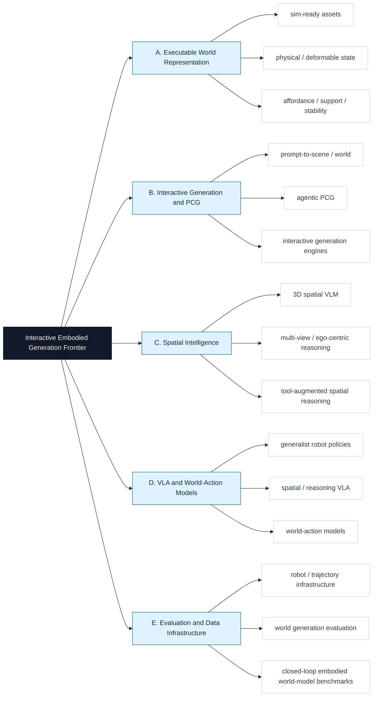

# Interactive Embodied Generation Frontier

面向 **可交互生成、具身智能、空间智能、VLA、可执行物理世界** 的 2024+ 前沿论文精读库。

这个仓库的核心不是堆论文列表，而是维护可复用的结构化精读报告：每篇最终收录论文都要说明原文链接、novelty、contribution、task、data、method、关键图/架构图、证据、局限和对我们任务的启发。

## 精读报告入口

| 内容 | 入口 |
|---|---|
| 层级化精读库 | [paper_reads/README.md](paper_reads/README.md) |
| 最新扩库摘要 | [reports/2026-08-31-expansion.md](reports/2026-08-31-expansion.md) |
| 当前已收录精读 | 101 篇，见 [paper_reads/README.md](paper_reads/README.md) |
| 待人工决定 | `undecided/` local-only，默认不上传 |

每次 run 的目的都是检查是否出现了新的高质量候选，并在通过标准后扩充知识库。run 目录只维护审计产物；最终论文精读统一沉淀到 `paper_reads/<branch>/<slug>.md`。通过筛选的候选应全部加入，不做固定 top-k 抽样。

## 本周更新内容

本轮扩库日期：2026-08-31。完整审计摘要见 [reports/2026-08-31-expansion.md](reports/2026-08-31-expansion.md)。

### 重点新增与补齐

| Paper | Branch | 简要说明 | 精读 |
|---|---|---|---|
| SpatialCrafter | B | Uses a persistent generative 3D proxy for controllable single-image world exploration. | [spatialcrafter-2026.md](paper_reads/B_interactive_generation_pcg/spatialcrafter-2026.md) |
| Gemini Robotics 2 | D | Extends VLA control to whole-body, cross-embodiment, and coordinated multi-robot tasks. | [gemini-robotics-2-2026.md](paper_reads/D_vla_world_action_models/gemini-robotics-2-2026.md) |
| CLAP | D | Open cross-embodiment video world model with policy-in-the-loop deployment. | [clap-cross-embodiment-world-models-2026.md](paper_reads/D_vla_world_action_models/clap-cross-embodiment-world-models-2026.md) |
| PAWBench | E | Evaluates support and probability mass across possible physical futures. | [pawbench-2026.md](paper_reads/E_evaluation_data_infrastructure/pawbench-2026.md) |
| R2M-Bench | E | Measures revisit-specific memory without rewarding static rollouts. | [r2m-bench-2026.md](paper_reads/E_evaluation_data_infrastructure/r2m-bench-2026.md) |

### 全量收录状态

| Branch | Count | Anchor works |
|---|---:|---|
| A. Executable World Representation | 11 | SceneFun3D, BEHAVIOR-1K, WonderPlay, PhysX-Omni, PhysDreamer, SceneCode ... |
| B. Interactive Generation and PCG | 15 | PhyScene, WonderWorld, SpatialCrafter, SAGE, EmbodiedGen V2, Image2Sim, SceneSmith ... |
| C. Spatial Intelligence | 15 | SpatialBot, HiSpatial, SpaceTools, Point-It-Out, ESI-Bench, SIS-Bench, SpatialVLA ... |
| D. VLA and World-Action Models | 33 | Octo, OpenVLA, Gemini Robotics 2, CLAP, ABot-PhysWorld, PAIWorld, G0.5, JEPA-WAM, Cosmos 3 ... |
| E. Evaluation and Data Infrastructure | 27 | PAWBench, R2M-Bench, PBench, PAI-Bench, PhysBench, Sekai2, MolmoSpaces, WorldArena ... |

## 研究树



## 自动化 Workflow

一轮检索会生成：

- `reports/runs/YYYY-MM-DD/`：run plan、discovery、evidence、review、editor report、registry patch、manifest。
- `paper_reads/<branch>/<slug>.md`：最终收录论文的长期精读报告。
- `reports/YYYY-MM-DD-expansion.md`：本轮扩库摘要；主要产物仍是 `paper_reads/` 与 `data/papers.seed.json`。
- `undecided/YYYY-MM-DD/CAND-xxxx.md`：无法判断视觉/demo 质量时的本地待定精读，默认不上传。

常用命令：

```bash
python scripts/scaffold_run.py YYYY-MM-DD
REQUIRE_UNDECIDED_DOSSIERS=1 python scripts/validate_all.py
python scripts/publish_validated_update.py --message "Expand frontier knowledge base YYYY-MM-DD"
```

发布脚本会校验、暂存、提交并 push 非 `undecided/` 变更；待定论文需要人工确认后再单独收录。

## 收录原则

- 只收录 2024 年及以后的 frontier work。
- 必须有 primary / official source，例如 arXiv、OpenReview、CVF、PMLR、官方项目页或官方 GitHub。
- 必须能回答 `data / method / task / novelty / project_relevance`。
- 生成类、交互世界、物理世界、VLA demo 类工作必须检查视觉或交互效果；无法判断就进入 `undecided/`。
- 通过阈值的候选应全部收录并生成精读，不按固定 top-k 截断。
- venue 不是硬门槛，效果、证据和项目相关性更重要。

详细规则见 [harness/acceptance_harness.md](harness/acceptance_harness.md) 和 [harness/system_harness.md](harness/system_harness.md)。
