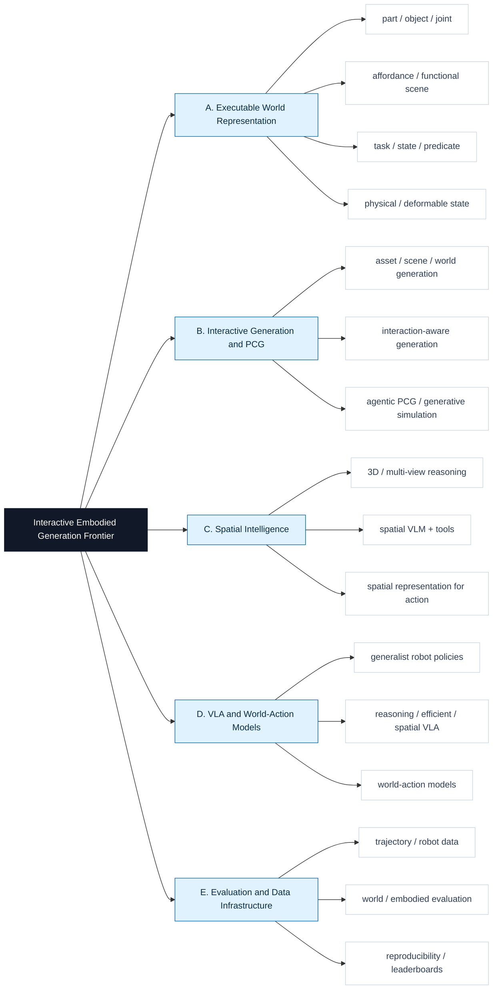

# Interactive Embodied Generation Frontier

面向 **可交互生成、具身智能、空间智能、VLA、可执行物理世界** 的 2024+ 前沿论文精读库。

这个仓库的核心不是堆论文列表，而是维护可复用的结构化精读报告：每篇最终收录论文都要说明原文链接、novelty、contribution、task、data、method、关键图/架构图、证据、局限和对我们任务的启发。

## 精读报告入口

| 内容 | 入口 |
|---|---|
| 层级化精读库 | [paper_reads/README.md](paper_reads/README.md) |
| 最新周报 | [reports/2026-06-06-weekly.md](reports/2026-06-06-weekly.md) |
| 当前已收录精读 | [OpenEQA 2024](paper_reads/E_evaluation_data_infrastructure/openeqa-2024.md) |
| 待人工决定 | `undecided/` local-only，默认不上传 |

每次自动检索 run 只维护审计产物；最终论文精读统一沉淀到 `paper_reads/<branch>/<slug>.md`。`05_registry_patch.json` 中的每个 `registry_additions` 条目必须包含 `deep_dive_path` 指向这个长期目录。

## 研究树



## 当前收录

| Paper | Branch | Why included | Deep dive |
|---|---|---|---|
| OpenEQA: Embodied Question Answering in the Era of Foundation Models | E | embodied QA benchmark，可作为生成交互世界的下游环境理解评测 | [openeqa-2024.md](paper_reads/E_evaluation_data_infrastructure/openeqa-2024.md) |

当前 registry 数据在 [data/papers.seed.json](data/papers.seed.json)，固定 follow 源在 [data/follow_sources.seed.json](data/follow_sources.seed.json)。

## 自动化 Workflow

一轮检索会生成：

- `reports/runs/YYYY-MM-DD/`：run plan、discovery、evidence、review、editor report、registry patch、manifest。
- `paper_reads/<branch>/<slug>.md`：最终收录论文的长期精读报告。
- `reports/YYYY-MM-DD-weekly.md`：本轮人类可读周报。
- `undecided/YYYY-MM-DD/CAND-xxxx.md`：无法判断视觉/demo 质量时的本地待定精读，默认不上传。

常用命令：

```bash
python scripts/scaffold_run.py YYYY-MM-DD
REQUIRE_UNDECIDED_DOSSIERS=1 python scripts/validate_all.py
python scripts/publish_validated_update.py --message "Weekly frontier scan YYYY-MM-DD"
```

发布脚本会校验、暂存、提交并 push 非 `undecided/` 变更；待定论文需要人工确认后再单独收录。

## 收录原则

- 只收录 2024 年及以后的 frontier work。
- 必须有 primary / official source，例如 arXiv、OpenReview、CVF、PMLR、官方项目页或官方 GitHub。
- 必须能回答 `data / method / task / novelty / project_relevance`。
- 生成类、交互世界、物理世界、VLA demo 类工作必须检查视觉或交互效果；无法判断就进入 `undecided/`。
- venue 不是硬门槛，效果、证据和项目相关性更重要。

详细规则见 [harness/acceptance_harness.md](harness/acceptance_harness.md) 和 [harness/system_harness.md](harness/system_harness.md)。

## 项目结构

```text
frontier_research/
  README.md
  data/
  paper_reads/
  reports/
    runs/
  agents/
  automation/
  harness/
  scripts/
  undecided/
```

Multi-agent 分工、hooks 和发布边界分别见 [agents/README.md](agents/README.md)、[harness/hooks.md](harness/hooks.md)、[READING_LIST_PROJECT.md](READING_LIST_PROJECT.md)。
