# Interactive Embodied Generation Frontier

> A curated frontier map for **interactive world generation, embodied AI, spatial intelligence, VLA, and executable physical worlds**.

本仓库面向 **可交互生成、具身智能、空间智能、VLA 和可执行物理世界** 相关研究者。它不是泛泛的 awesome list，而是一个服务于论文选题、baseline 选择、related work 组织和定期文献追踪的前沿研究地图。

内部可以围绕某个具体任务继续扩展，例如 typed interaction representation、interactive scene generation benchmark、VLA evaluation harness 等；但仓库本身保持领域级命名和领域级分类。

## 这个 Repo 做什么

- 维护一个收窄后的层级化前沿研究树。
- 收录与可交互生成和具身智能强相关的 **2024 年及以后** 论文、项目页、代码、demo 和 benchmark。
- 按固定 harness 提取每篇工作的 `data / method / task / novelty / project_relevance`。
- 对每篇最终收录论文生成结构化精读，包含原文链接、novelty、contribution、task、data、method、关键图/架构图、局限和项目启发。
- 固定 follow 该领域核心 PI、实验室和公司研究组，避免只靠关键词检索漏掉新方向。
- 通过文件驱动的 multi-agent Codex workflow 每周检索新论文，并生成可审查的周报。
- 为后续写 related work、设计实验和选择 baseline 提供结构化依据。

## 边界

这个项目当前只做 **前沿论文收录和证据化整理**。

它不是 autonomous scientist，也不自动生成研究假设、设计实验、改写论文或重排研究方向。可以借鉴科研 agent / skill 的工程做法，但只服务于收录质量：

- 把检索、证据提取、视觉审查和编辑拆成可复用的固定角色。
- 对关键 claim 记录 primary source、项目页、代码、demo 或图表来源。
- 保持候选状态可审查：`analyze`、`watchlist`、`reject`、`undecided`、`accepted_for_registry`。
- 把不确定的 demo / visual 判断交给 `undecided/` 和人工复核，而不是让 agent 自行补结论。

项目维护、GitHub 上传边界和文件纳入规则见：

[READING_LIST_PROJECT.md](READING_LIST_PROJECT.md)

## 研究树

```mermaid
flowchart TD
  R["Interactive Embodied Generation Frontier"]

  R --> A["A. Executable World Representation"]
  A --> A1["A1. Part / Object / Joint"]
  A --> A2["A2. Affordance / Functional Scene"]
  A --> A3["A3. Task / State / Predicate"]
  A --> A4["A4. Physical / Deformable State"]
  A1 --> A11["ArtFormer<br/>Articulate-Anything<br/>PhysX-Anything"]
  A2 --> A21["SceneFun3D<br/>MomaGraph / FunGraph"]
  A3 --> A31["BEHAVIOR-1K / BDDL<br/>RoboCasa"]
  A4 --> A41["PhysX-Anything<br/>PhysForge<br/>PhysX-Omni<br/>PhysTwin"]

  R --> B["B. Interactive Generation and PCG"]
  B --> B1["B1. Asset / Scene / World Generation"]
  B --> B2["B2. Interaction-Aware Generation"]
  B --> B3["B3. Agentic PCG / Generative Simulation"]
  B1 --> B11["Holodeck<br/>Infinigen Indoors<br/>EmbodiedGen"]
  B2 --> B21["PhyScene<br/>SceneFactor<br/>WorldGen"]
  B3 --> B31["RoboGen<br/>GenSim / GenSim2<br/>Steerable Scene Generation<br/>SAGE"]

  R --> C["C. Spatial Intelligence"]
  C --> C1["C1. 3D / Multi-view Spatial Reasoning"]
  C --> C2["C2. Spatial VLM + Tool Use"]
  C --> C3["C3. Spatial Representation for Action"]
  C1 --> C11["SpatialBot<br/>Ego3D-Bench<br/>MV-RoboBench"]
  C2 --> C21["HiSpatial<br/>SpaceTools"]
  C3 --> C31["SpatialVLA<br/>DepthVLA<br/>ST-VLA"]

  R --> D["D. VLA and World-Action Models"]
  D --> D1["D1. Generalist Robot Policies"]
  D --> D2["D2. Reasoning / Efficient / Spatial VLA"]
  D --> D3["D3. World-Action Models"]
  D1 --> D11["Octo<br/>OpenVLA<br/>pi0<br/>SmolVLA"]
  D2 --> D21["SmolVLA / BitVLA<br/>VLA-R1<br/>Gemini Robotics"]
  D3 --> D31["World Action Models<br/>Physically Viable World Models"]

  R --> E["E. Evaluation and Data Infrastructure"]
  E --> E1["E1. Trajectory and Robot Data"]
  E --> E2["E2. World / Embodied Evaluation"]
  E --> E3["E3. Repository and Reproducibility"]
  E1 --> E11["RoboVerse<br/>RoboTwin<br/>DexMimicGen"]
  E2 --> E21["EWMBench<br/>WorldScore<br/>WorldArena"]
  E3 --> E31["project pages<br/>code / checkpoints<br/>demos / leaderboards"]

  classDef root fill:#111827,stroke:#111827,color:#ffffff;
  classDef branch fill:#e0f2fe,stroke:#0369a1,color:#082f49;
  classDef sub fill:#f8fafc,stroke:#94a3b8,color:#0f172a;
  classDef leaf fill:#ffffff,stroke:#cbd5e1,color:#334155;
  class R root;
  class A,B,C,D,E branch;
  class A1,A2,A3,A4,B1,B2,B3,C1,C2,C3,D1,D2,D3,E1,E2,E3 sub;
  class A11,A21,A31,A41,B11,B21,B31,C11,C21,C31,D11,D21,D31,E11,E21,E31 leaf;
```



## 层级化分类

### A. Executable World Representation

研究对象：可执行世界的中间表示。

这一类回答：一个生成出来的世界要被 agent 使用，必须具备哪些结构化字段？

| 子类 | 核心问题 | 代表工作 |
|---|---|---|
| A1. Part / Object / Joint | 物体由哪些部件组成，部件如何运动？ | ArtFormer, Articulate-Anything, PhysX-Anything |
| A2. Affordance / Functional Scene | 场景中哪些区域、物体、部件可以被操作？ | SceneFun3D, MomaGraph, FunGraph |
| A3. Task / State / Predicate | 任务、状态变化和成功条件如何形式化？ | BEHAVIOR-1K, BDDL, OmniGibson, RoboCasa |
| A4. Physical / Deformable State | 物体的质量、摩擦、刚度、形变状态如何表示？ | PhysX-Anything, PhysForge, PhysX-Omni, PhysTwin |

可复用字段：`Object`, `Part`, `Joint`, `Affordance`, `StatePredicate`, `PhysicalProperty`, `DeformableState`。

### B. Interactive Generation and PCG

研究对象：生成可交互资产、场景、任务和完整 embodied worlds。

这一类回答：如何从语言、任务或程序化规则生成可被仿真器和 agent 使用的世界？

| 子类 | 核心问题 | 代表工作 |
|---|---|---|
| B1. Asset / Scene / World Generation | 如何生成视觉和语义上合理的 3D 世界？ | Holodeck, Infinigen Indoors, EmbodiedGen |
| B2. Interaction-Aware Generation | 如何让生成结果满足碰撞、可达、可操作、稳定性约束？ | PhyScene, SceneFactor, WorldGen |
| B3. Agentic PCG / Generative Simulation | 如何用 LLM/VLM agent、搜索、critic 和仿真闭环生成任务/场景/数据？ | RoboGen, GenSim, GenSim2, Steerable Scene Generation, SAGE |

项目关注点：作为生成器的输入约束、输出格式和 interaction-aware evaluator。

### C. Spatial Intelligence

研究对象：空间推理能力，尤其是 3D、多视角、深度、度量关系和工具调用。

这一类回答：模型如何理解 “left of / inside / reachable / behind / closer / farther / from another view” 这类空间关系？

| 子类 | 核心问题 | 代表工作 |
|---|---|---|
| C1. 3D / Multi-view Spatial Reasoning | 如何从单视角、多视角或 egocentric 观察中恢复空间关系？ | SpatialBot, Ego3D-Bench, MV-RoboBench |
| C2. Spatial VLM + Tool Use | 如何让 VLM 调用深度、检测、测量、机器人工具来做精确空间判断？ | HiSpatial, SpaceTools |
| C3. Spatial Representation for Action | 如何把空间表征接入机器人动作生成？ | SpatialVLA, DepthVLA, ST-VLA |

项目关注点：从 observation 解析 `Scene.spatial_graph`，补全 `reachable`, `inside`, `support`, `near`, `view-dependent relation` 等边。

### D. VLA and World-Action Models

研究对象：视觉-语言-动作模型，以及 action-conditioned world modeling。

这一类回答：agent 如何从视觉和语言直接产生动作？它是否理解动作会怎样改变世界？

| 子类 | 核心问题 | 代表工作 |
|---|---|---|
| D1. Generalist Robot Policies | 如何用大规模多机器人数据训练通用策略？ | Octo, OpenVLA, pi0, SmolVLA |
| D2. Reasoning / Efficient / Spatial VLA | 如何让 VLA 更小、更强、更会空间推理和任务分解？ | SmolVLA, BitVLA, VLA-R1, Gemini Robotics |
| D3. World-Action Models | 如何建模动作介入后的世界状态变化？ | World Action Models, Physically Viable World Models |

项目关注点：把 `Task`、`Scene`、`Affordance` 和 `StateTransition` 交给 VLA 或 world-action model 做执行与验证。

### E. Evaluation and Data Infrastructure

研究对象：数据标准、benchmark、leaderboard、demo 和复现基础设施。

这一类回答：如何判断一个生成世界真的可用、可比、可复现？

| 子类 | 核心问题 | 代表工作 |
|---|---|---|
| E1. Trajectory and Robot Data | 如何标准化轨迹、演示和机器人数据？ | RoboVerse, RoboTwin, DexMimicGen |
| E2. World / Embodied Evaluation | 如何评价 world generation / world model 的质量、交互性和一致性？ | EWMBench, WorldScore, WorldArena, EmbodiedBench |
| E3. Repository and Reproducibility | 如何记录项目页、代码、checkpoint、demo、leaderboard？ | Awesome VLA Papers, Awesome Physical AI, Awesome Spatial Intelligence in VLM |

项目关注点：定义 `ValidationReport`，支撑 interactive embodied generation benchmark 的任务可执行性、物理有效性、空间一致性和下游成功率评估。

## 如何使用

### 查看当前收录

```bash
python frontier_research/scripts/validate_registry.py
```

当前 registry 在：

[data/papers.seed.json](data/papers.seed.json)

固定 follow 源在：

[data/follow_sources.seed.json](data/follow_sources.seed.json)

可读版说明：

[data/follow_sources.md](data/follow_sources.md)

### 每周自动检索

Codex 自动化会读取：

[automation/weekly_scan_prompt.md](automation/weekly_scan_prompt.md)

并按以下流程工作：

1. 在 `reports/runs/YYYY-MM-DD/` 下创建一次 run。
2. 由 5 个合并 agent 阶段依次写入 run plan、discovery、evidence、review、editor report 和 registry patch。
3. Discovery Agent 先检查 [data/follow_sources.seed.json](data/follow_sources.seed.json) 中的核心 PI/lab/company 源，并在 `followed_sources_checked` 里记录。
4. 对每篇 registry addition 写入 `reports/runs/YYYY-MM-DD/paper_reads/CAND-xxxx.md` 精读。
5. 用 [harness/system_harness.md](harness/system_harness.md) 检查系统执行是否合规。
6. 用 [harness/acceptance_harness.md](harness/acceptance_harness.md) 检查论文是否值得收录。
7. 输出周报到 `reports/YYYY-MM-DD-weekly.md`。
8. 只把强相关、高质量、来源可靠、且已完成精读的条目写入 registry。

### 多 Agent 分工

设计见：

[agents/README.md](agents/README.md)

详细系统设计见：

[agents/multiagent_design.md](agents/multiagent_design.md)

默认角色：

- Research Lead：决定本轮检索范围和 query，并指定固定 follow 源表。
- Discovery Agent：先检查固定 PI/lab/company 源，再做全网检索、去重和 analyze / watchlist / reject 初筛。
- Evidence Analyst：深读论文，提取 data / method / task / novelty，并核验项目页、代码、demo。
- Quality Reviewer：检查来源、视觉生成效果、机器人执行视频、过度声称和 harness 合规性。
- Taxonomy & Editor：确定分支归类，为每篇收录论文写精读，输出周报和 registry patch。

## 收录原则

本仓库不追求“越多越好”。论文必须满足：

- 与本仓库五个一级分支之一强相关。
- 年份必须为 2024 年及以后；2024 年以前的经典基础文献不进入 frontier registry。
- 有 primary source，例如 arXiv、OpenReview、CVF、PMLR、官方项目页或官方 GitHub。
- 能明确回答 `data / method / task / novelty / project relevance`。
- demo、代码、checkpoint 或 benchmark 信息需标注来源和质量。
- 对生成类、可交互世界、物理世界、VLA demo 类工作，必须检查视觉/交互效果；无法判断时进入 `undecided/`，不直接收录。
- 每篇进入 registry patch 的论文必须有 `paper_reads/CAND-xxxx.md` 精读，说明原文链接、novelty、contribution、task、data、method、关键图/架构图、证据和局限。

论文质量规则见：

[harness/acceptance_harness.md](harness/acceptance_harness.md)

系统执行规则见：

[harness/system_harness.md](harness/system_harness.md)

## Hooks 和校验

Hooks 不是必须的。建议先手动运行：

```bash
python frontier_research/scripts/validate_registry.py
```

如果要启用本地 pre-commit hook：

```bash
git config core.hooksPath frontier_research/.githooks
```

说明见：

[harness/hooks.md](harness/hooks.md)

## Repo Layout

```text
frontier_research/
  README.md
  READING_LIST_PROJECT.md
  data/
    papers.seed.json
    follow_sources.seed.json
  agents/
    multiagent_design.md
    specs/
  automation/
    codex_workflow.md
    weekly_scan_prompt.md
  harness/
    acceptance_harness.md
    artifact_contracts.md
    hooks.md
    system_harness.md
  reports/
    runs/
      YYYY-MM-DD/
        paper_reads/
    weekly_report_template.md
    paper_deep_dive_template.md
  undecided/
  scripts/
    scaffold_run.py
    validate_run.py
    validate_registry.py
```
