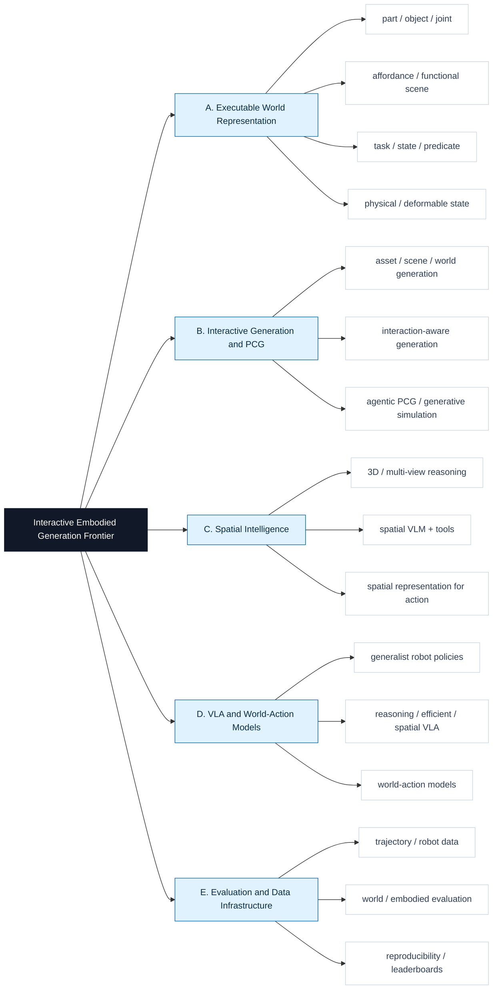

# Interactive Embodied Generation Frontier

面向 **可交互生成、具身智能、空间智能、VLA、可执行物理世界** 的 2024+ 前沿论文精读库。

这个仓库的核心不是堆论文列表，而是维护可复用的结构化精读报告：每篇最终收录论文都要说明原文链接、novelty、contribution、task、data、method、关键图/架构图、证据、局限和对我们任务的启发。

## 精读报告入口

| 内容 | 入口 |
|---|---|
| 层级化精读库 | [paper_reads/README.md](paper_reads/README.md) |
| 最新扩库摘要 | [reports/2026-06-06-expansion.md](reports/2026-06-06-expansion.md) |
| 当前已收录精读 | 15 篇，见 [paper_reads/README.md](paper_reads/README.md) |
| 待人工决定 | `undecided/` local-only，默认不上传 |

每次 run 的目的都是检查是否出现了新的高质量候选，并在通过标准后扩充知识库。run 目录只维护审计产物；最终论文精读统一沉淀到 `paper_reads/<branch>/<slug>.md`。`05_registry_patch.json` 中的每个 `registry_additions` 条目必须包含 `deep_dive_path` 指向这个长期目录。

## 本周更新内容

本轮初始化扩库日期：2026-06-06。完整审计摘要见 [reports/2026-06-06-expansion.md](reports/2026-06-06-expansion.md)。

### 新增收录

| Paper | Branch | 简要说明 | 精读 |
|---|---|---|---|
| PhysDreamer | A | 从视频生成先验估计物体材料/动态响应，适合作为软体、弹性物体交互生成参考。 | [physdreamer-2024.md](paper_reads/A_executable_world_representation/physdreamer-2024.md) |
| Feature Splatting | A | 把 3D Gaussian 表示扩展到语言、材质和物理编辑，适合做物理属性和可编辑场景表示参考。 | [feature-splatting-2024.md](paper_reads/A_executable_world_representation/feature-splatting-2024.md) |
| Holodeck | B | 语言驱动生成 AI2-THOR embodied environments，是 prompt-to-scene 和下游导航评测的重要基线。 | [holodeck-2024.md](paper_reads/B_interactive_generation_pcg/holodeck-2024.md) |
| Infinigen Indoors | B | 高质量程序化室内场景生成，提供真实几何和密集标注，是 PCG/合成数据强基线。 | [infinigen-indoors-2024.md](paper_reads/B_interactive_generation_pcg/infinigen-indoors-2024.md) |
| OpenEQA | E | 开放词表 embodied QA benchmark，可用于评测生成世界是否保留环境语义和空间关系。 | [openeqa-2024.md](paper_reads/E_evaluation_data_infrastructure/openeqa-2024.md) |

### 补齐精读

| Paper | Branch | 简要说明 | 精读 |
|---|---|---|---|
| SceneFun3D | A | 真实 3D 场景中的功能部件、affordance、任务语言和运动参数标注。 | [scenefun3d-2024.md](paper_reads/A_executable_world_representation/scenefun3d-2024.md) |
| BEHAVIOR-1K | A | 1000 个日常活动、BDDL 状态谓词和 OmniGibson 执行环境。 | [behavior-1k-2024.md](paper_reads/A_executable_world_representation/behavior-1k-2024.md) |
| PhysX-Omni | A | 面向刚体、软体/形变体和关节物体的 simulation-ready 物理 3D 生成。 | [physx-omni-2026.md](paper_reads/A_executable_world_representation/physx-omni-2026.md) |
| PhyScene | B | 带碰撞、可达性、房间约束和机器人交互验证的物理可交互场景生成。 | [physcene-2024.md](paper_reads/B_interactive_generation_pcg/physcene-2024.md) |
| RoboGen | B | propose-generate-learn 闭环，自动生成机器人任务、场景、监督和技能。 | [robogen-2024.md](paper_reads/B_interactive_generation_pcg/robogen-2024.md) |
| SpatialVLA | C | 将 3D spatial encoding 和 adaptive action grids 接入 VLA，用于空间指令执行。 | [spatialvla-2025.md](paper_reads/C_spatial_intelligence/spatialvla-2025.md) |
| Octo | D | 开源 generalist robot policy，适合作为生成任务/场景的策略执行 baseline。 | [octo-2024.md](paper_reads/D_vla_world_action_models/octo-2024.md) |
| OpenVLA | D | 开源 7B VLA，提供模型、代码和 finetuning 路径，是默认 VLA baseline。 | [openvla-2024.md](paper_reads/D_vla_world_action_models/openvla-2024.md) |
| pi0 | D | VLA flow model，真实机器人高质量 dexterous demos，适合作为效果上限参考。 | [pi0-2024.md](paper_reads/D_vla_world_action_models/pi0-2024.md) |
| RoboVerse | E | 统一 robot learning platform/dataset/benchmark，用于任务、轨迹和 baseline 评测组织。 | [roboverse-2025.md](paper_reads/E_evaluation_data_infrastructure/roboverse-2025.md) |

## 研究树



## 当前精读库

初始化批次已经覆盖 15 篇高质量工作：A 分支 5 篇，B 分支 4 篇，C 分支 1 篇，D 分支 3 篇，E 分支 2 篇。完整列表见 [paper_reads/README.md](paper_reads/README.md)。

| Branch | Anchor works |
|---|---|
| A | SceneFun3D, BEHAVIOR-1K, PhysX-Omni, PhysDreamer, Feature Splatting |
| B | PhyScene, Holodeck, Infinigen Indoors, RoboGen |
| C | SpatialVLA |
| D | Octo, OpenVLA, pi0 |
| E | OpenEQA, RoboVerse |

当前 registry 数据在 [data/papers.seed.json](data/papers.seed.json)，固定 follow 源在 [data/follow_sources.seed.json](data/follow_sources.seed.json)。

## 自动化 Workflow

一轮检索会生成：

- `reports/runs/YYYY-MM-DD/`：run plan、discovery、evidence、review、editor report、registry patch、manifest。
- `paper_reads/<branch>/<slug>.md`：最终收录论文的长期精读报告。
- `reports/YYYY-MM-DD-expansion.md`：本轮扩库摘要，用于记录新增、拒绝和待定项；不是主要产物。
- `undecided/YYYY-MM-DD/CAND-xxxx.md`：无法判断视觉/demo 质量时的本地待定精读，默认不上传。

常用命令：

```bash
python scripts/scaffold_run.py YYYY-MM-DD
REQUIRE_UNDECIDED_DOSSIERS=1 python scripts/validate_all.py
python scripts/publish_validated_update.py --message "Expand frontier knowledge base YYYY-MM-DD"
```

发布脚本会校验、暂存、提交并 push 非 `undecided/` 变更；待定论文需要人工确认后再单独收录。

## 收录原则

- 只收录 2024 年及以后的 frontier work。
- 必须有 primary / official source，例如 arXiv、OpenReview、CVF、PMLR、官方项目页或官方 GitHub。
- 必须能回答 `data / method / task / novelty / project_relevance`。
- 生成类、交互世界、物理世界、VLA demo 类工作必须检查视觉或交互效果；无法判断就进入 `undecided/`。
- venue 不是硬门槛，效果、证据和项目相关性更重要。

详细规则见 [harness/acceptance_harness.md](harness/acceptance_harness.md) 和 [harness/system_harness.md](harness/system_harness.md)。

## 项目结构

```text
frontier_research/
  README.md
  data/
  paper_reads/
  reports/
    runs/
  agents/
  automation/
  harness/
  scripts/
  undecided/
```

Multi-agent 分工、hooks 和发布边界分别见 [agents/README.md](agents/README.md)、[harness/hooks.md](harness/hooks.md)、[READING_LIST_PROJECT.md](READING_LIST_PROJECT.md)。
