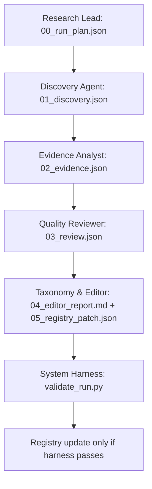

# Multi-Agent System Design

This system is a **consolidated file-driven research pipeline**. Agents do not freely chat with each other. Each agent reads fixed input artifacts, writes fixed output artifacts, and is checked by the system harness.

The goal is to maintain a frontier research repository for interactive generation, embodied AI, spatial intelligence, VLA, and executable physical worlds without drifting into a noisy generic paper list.

The repository is **2024+ only**. Historical papers can be mentioned as background in prose, but they are not valid candidates for the frontier registry.

## Scope Guard

This system is a paper-collection and evidence-curation workflow. It should not behave like an autonomous scientist.

Allowed agent/skill-inspired practices:

- package each role as a reusable, narrow instruction set;
- keep source traces for important claims;
- separate discovery, evidence extraction, review, and registry editing;
- preserve uncertain items as watchlist or undecided dossiers.

Out of scope for this repository:

- autonomous hypothesis generation or research-roadmap ranking;
- experiment design beyond short collection notes for baseline usefulness;
- routine taxonomy rewrites during expansion runs;
- accepting claims that are not traceable to primary or official sources.

## Design Principle

One agent, one coherent job.

The earlier version split search, triage, paper extraction, demo verification, visual review, taxonomy, review, and editing into many small agents. That is auditable, but too operationally heavy for repeated knowledge-base expansion. The current design merges adjacent responsibilities while preserving the hard gates that matter.

| Agent | Main job | Decision authority | Writes |
|---|---|---|---|
| Research Lead | Scope the run | which branches/queries to search | `00_run_plan.json` |
| Discovery Agent | Follow fixed sources, search, and cheap filtering | analyze / watchlist / reject | `01_discovery.json` |
| Evidence Analyst | Deep paper + demo extraction | evidence extraction only | `02_evidence.json` |
| Quality Reviewer | Source audit, visual inspection, acceptance gate | pass / needs_revision / block | `03_review.json` |
| Taxonomy & Editor | Branch assignment, accepted-paper deep dives, final report, patch draft | registry patch from passed items only | `04_editor_report.md`, `05_registry_patch.json`, `paper_reads/<branch>/<slug>.md` |

Only the Taxonomy & Editor may create a registry update draft, and that draft must pass `scripts/validate_run.py` plus `scripts/validate_registry.py` before it is applied.

## Responsibility Matrix

| Question | Owner | Notes |
|---|---|---|
| What should this run search? | Research Lead | Uses taxonomy, recent expansion summaries, and conference/release windows. |
| Is this candidate worth analysis time? | Discovery Agent | Checks fixed PI/lab/company sources, searches, deduplicates, and triages in one artifact. |
| What does the paper actually do? | Evidence Analyst | Extracts data/method/task/novelty and verifies demo/code links. |
| Are the demos and visual results good enough? | Quality Reviewer | Uses project pages, videos, GIFs, figures, robot demos, and generated samples. |
| Does it fit the current tree? | Taxonomy & Editor | Assigns branch fit and records proposal-only taxonomy changes. |
| What enters the registry patch? | Taxonomy & Editor | Only reviewer-passed items with complete deep dives can enter patch. |
| Did the system run correctly? | System Harness | `validate_run.py` checks the artifacts. |

## Directory Contract

A knowledge-expansion run lives under:

```text
reports/runs/YYYY-MM-DD/
  00_run_plan.json
  01_discovery.json
  02_evidence.json
  03_review.json
  04_editor_report.md
  05_registry_patch.json
  run_manifest.json
```

Accepted-paper deep dives are maintained outside the run folder:

```text
paper_reads/<branch>/<slug>.md
```

Each `registry_additions` item must include `deep_dive_path` pointing to that maintained report. Agents may only write their assigned stage file, plus the Taxonomy & Editor may update the maintained deep-dive library for accepted papers. This keeps runs auditable while keeping final reading reports in one stable hierarchy.

## Pipeline



## Agent Specs

- [Research Lead](specs/research_lead.md)
- [Discovery Agent](specs/discovery_agent.md)
- [Evidence Analyst](specs/evidence_analyst.md)
- [Quality Reviewer](specs/quality_reviewer.md)
- [Taxonomy & Editor](specs/taxonomy_editor.md)

## Failure Policy

- If Research Lead fails to set `minimum_year: 2024`, the run fails.
- If Discovery Agent produces pre-2024 registry candidates, it must reject them or the harness fails.
- If Discovery rejects all candidates, Taxonomy & Editor writes a no-update report.
- If Evidence Analyst cannot identify method/task/data, the paper cannot be accepted in that run.
- If a central claim cannot be tied to a primary or official source, it must be marked as unverified and cannot be used as acceptance evidence.
- If demo claims cannot be verified, demo score is capped and Quality Reviewer may block.
- If Quality Reviewer cannot judge visual/generation quality, the candidate goes to `undecided/YYYY-MM-DD/` and cannot enter the registry in that run.
- If a generation-heavy paper has weak visual results, it is blocked even if it has a good venue.
- If Taxonomy & Editor proposes a new top-level branch, it must be marked `proposal_only`.
- If a registry addition lacks a valid `deep_dive_path` under top-level `paper_reads/`, the run fails.
- If registry patch is created without harness validation, the update is invalid.

## What This System Harness Checks

The system harness checks the **workflow execution**, not paper taste:

- all required stage files exist,
- JSON artifacts parse,
- all run ids match,
- each candidate has a stable id,
- fixed follow-source checks are recorded,
- triage decisions refer to known candidates,
- paper/demo/review cards refer to valid candidates,
- rejected candidates are not analyzed or added to registry,
- undecided visual-quality candidates are not added to registry patch,
- every registry addition has a complete top-level paper deep dive,
- taxonomy changes are proposal-only,
- final report exists,
- registry patch is structurally valid.

The separate paper acceptance harness checks paper relevance and quality:

- [acceptance_harness.md](../harness/acceptance_harness.md)

## Recommended Use in Codex

For reliable execution, run one Codex task per consolidated role:

1. "Run Research Lead for YYYY-MM-DD and write only `00_run_plan.json`."
2. "Run Discovery Agent using `00_run_plan.json` and `data/follow_sources.seed.json`; write only `01_discovery.json`."
3. "Run Evidence Analyst using `01_discovery.json` and write only `02_evidence.json`."
4. "Run Quality Reviewer using `01/02` artifacts and write only `03_review.json` plus any undecided dossiers."
5. "Run Taxonomy & Editor using all previous artifacts; write only `04_editor_report.md`, `05_registry_patch.json`, accepted-paper `paper_reads/<branch>/<slug>.md` reports, and manifest updates."

This keeps the model focused without turning the workflow into too many tiny tasks.

## Minimal Local Smoke Test

Use this to test the harness without doing a real web search:

```bash
python frontier_research/scripts/scaffold_run.py YYYY-MM-DD
python frontier_research/scripts/validate_run.py YYYY-MM-DD
python frontier_research/scripts/validate_registry.py
```

Use a non-empty dry-run when changing schemas or agent contracts.
